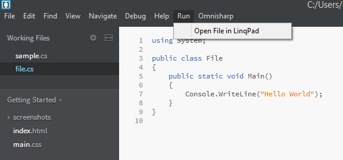

# Brackets-LinqSharp

Brackets-LinqSharp is an extension for [Brackets](http://brackets.io/) editor - with the help of OmniSharp for brackets, you can 
compose C# programs with intellisense - but unfortunately you cannot run them! That's where this extension comes in to the picture.
With this extension a new menu called "Run" is created, which has just one item for now - "Open File in LinqPad". If you have LinqPad
interested, the current file will be opened in LinqPad as a C# program!

Obviously, this would work even if you don't have OmniSharp, but you have a C# program. This is a `work-in-progress`. So this will
be changing for a while now!

To use this, just download the extension, extrack in to the "extensions" folder of brackets (`Help -> Show Extensions Folder`)

## Some screenshots:

  
*A sample C# program w/ the Run -> Open File in LinqPad menu*

If you like to watch this extension in action, here is a [demo video](http://www.screencast.com/t/BYXGS6TYJJUr)!

```text
PS: If you have purchased the autocompletion feature of LinqSharp, this extension is irrelevant!
```
